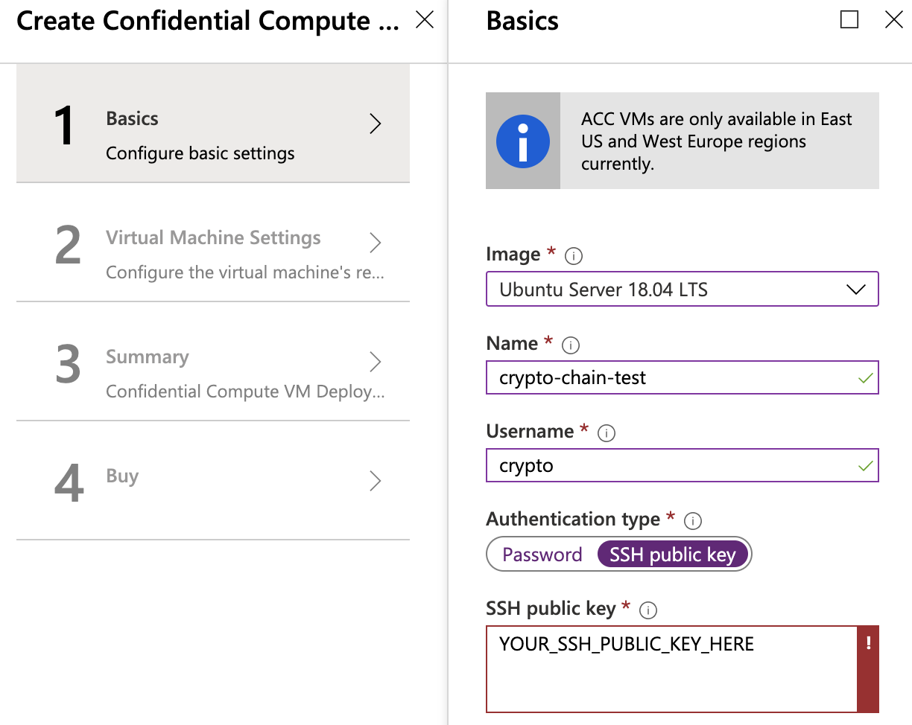
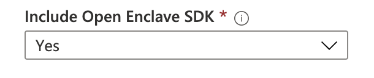
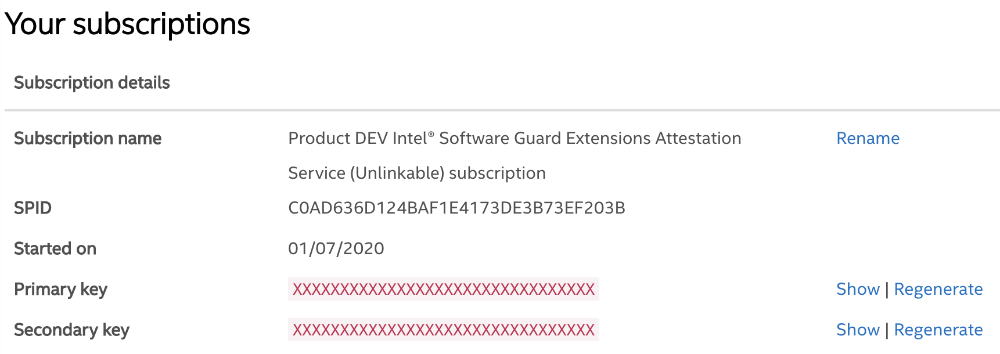

# Getting Started

::: warning Caution
This page is for the development environment set up only, and it is subject to changes.

For anyone interested in joining the Crypto.com chain testnet,
please refer to our [testnet documentation](./thaler-testnet).
:::

By following this tutorial, you can compile and run latest version of Crypto.com Chain from scratch.
Again, this document aims to provide you a step-by-step guide to run Crypto.com Chain locally and not for
production usage.

## Pre-requisites

Because we utilize the technology of `Intel® Software Guard Extensions (Intel® SGX)`
for [payment data confidentiality](./transaction-privacy.md#motivation ), the pre-requisites are a little more strict than the other
chains' setup. A special type of hardware is needed and the reference of [SGX-hardware](https://github.com/ayeks/SGX-hardware)
could help you identify if your current hardware supports `Intel® SGX` or not.

If your development machine does not support SGX, we recommend spinning up a cloud instance listed in the [above reference](https://github.com/ayeks/SGX-hardware#cloud-vendors). In this guide, we will walk through the process of setting it up on [Azure Confidential Compute VM](https://azuremarketplace.microsoft.com/en-us/marketplace/apps/microsoft-azure-compute.confidentialcompute?tab=Overview).

## The big picture

If you are the first time to setup a node of Crypto.com Chain, a warm reminder is that
it may take you one hour or two to fully setup a development environment and run the Chain. But, `DON'T PANIC` we will
guide you through it.

Before diving into details and ~~possible~~ dependency hell, we would like to introduce you the big picture of Crypto.com Chain's main components as following:


At the end of this getting-start document, you will be running four components:
- `tx-validation-app` with `ZeroMQ` using Docker.
- `tx-query-app` with SGX environment.
- `Tendermint` for consensus.
- `chain-abci` as main chain process.

## Azure VM creation

Get into the portal of Azure computing and create a new [Azure Confidential Compute VM](https://azuremarketplace.microsoft.com/en-us/marketplace/apps/microsoft-azure-compute.confidentialcompute?tab=Overview) as following config. Noted that `Ubuntu Server 18.04 LTS` is recommended.



Make sure include the Open Enclave SDK:



Then choose your desirable VM `location`, `size`, `storage` and `network configs`, or you can leave
 them as default.

## VM environment setup

SSH to the Azure VM, and start the environment setup for Crypto.com Chain.

- Install `Docker`: you can refer to following document [How To Install and Use Docker on Ubuntu 18.04
](https://www.digitalocean.com/community/tutorials/how-to-install-and-use-docker-on-ubuntu-18-04)

- Install & setup `Rust` and with utilization of multiple new feature of Rust,
we should use `nightly-2019-11-25` to build the chain.
```
$ curl --proto '=https' --tlsv1.2 -sSf https://sh.rustup.rs | sh
$ source $HOME/.cargo/env
$ rustup default nightly-2019-11-25
```
- Install `cmake`, `pkg-config` for building process.
```
sudo apt install cmake pkg-config
```
- Install `ZeroMQ` for components communication via message queue .
```
sudo apt install libzmq3-dev
```

## Compile & run chain-tx-validation

First, please clone the chain project with:
```
git clone https://github.com/crypto-com/chain.git
```

### Parameters Explaination

- `SGX_MODE`:
  - `SW` for Software Simulation mode
  - `HW` for Hardware mode **(✓ for Azure)**
- `NETWORK_HEX_ID`: Network HEX Id of Tendermint **(`AB` for testing)**
- `APP_PORT`: Listening Port inside the Docker instance **(Default: 25933)**

### Build with docker
Run following command under `./chain` folder, please double check the directory.

```
docker build -t chain-tx-validation -f ./chain-tx-enclave/tx-validation/Dockerfile . --build-arg SGX_MODE=HW --build-arg NETWORK_ID=AB
```

### Run with docker

```
docker run --rm --device /dev/sgx -p 25933:25933 --env RUST_BACKTRACE=1 --env RUST_LOG=info chain-tx-validation
```

Now, your `chain-tx-validation` component is LIVE.


## Setup SGX Environment

Following will guide you to setup `SGX` environment for `tx-query`. At the end of
this part, you should successfully run the test project of `linux-sgx`. The process
could be tedious but it won't take you a long time.

First, clone the `linux-sqx` repo:

```
git clone https://github.com/intel/linux-sgx.git
```

You could refer to the [installation docs](https://github.com/intel/linux-sgx#prerequisites)
 from the repo, or follow the commands below:

```
$ cd linux-sgx
$ sudo apt-get install build-essential ocaml ocamlbuild automake autoconf libtool wget python libssl-dev
$ sudo apt-get install libssl-dev libcurl4-openssl-dev protobuf-compiler libprotobuf-dev debhelper cmake
$ ./download_prebuilt.sh

------------ BEGIN MAKE SDK ------------
$ make sdk
$ make sdk_install_pkg
$ ./linux/installer/bin/sgx_linux_x64_sdk_2.7.101.3.bin
$ source ~/intel/sgxsdk/environment
------------- END MAKE SDK -------------

------------ BEGIN MAKE PSW ------------
$ make psw
$ make psw_install_pkg
$ ./linux/installer/bin/sgx_linux_x64_psw_2.7.101.3.bin
$ cd /opt/intel/sgxpsw/aesm
$ LD_LIBRARY_PATH=$PWD ./aesm_service
------------- END MAKE PSW -------------
```

For information that, psw is a middleware for SGX and you could now double check
if `psw` is running by:
```
ps ax | grep aesm
```

If there exist the middleware program, then you could move to `SampleCode` and
run a test project:
```
$ cd ~/linux-sgx/SampleCode/LocalAttestation
$ make
$ ./app
```

You should get follow result:
```
Available Enclaves
Enclave1 - EnclaveID 2
Enclave2 - EnclaveID 3
Enclave3 - EnclaveID 4

Secure Channel Establishment between Source (E1) and Destination (E2) Enclaves successful !!!
Enclave to Enclave Call between Source (E1) and Destination (E2) Enclaves successful !!!
Message Exchange between Source (E1) and Destination (E2) Enclaves successful !!!

...

Close Session between Source (E1) and Destination (E3) Enclaves successful !!!
Close Session between Source (E2) and Destination (E3) Enclaves successful !!!
Close Session between Source (E3) and Destination (E1) Enclaves successful !!!
Hit a key....
```

Congradulations! We have setup the enclave environment for `tx-query-app` to run on!

## Compile & run tx-query-app

Go to the `tx-query` folder and run `make`:
```
$ cd ~/chain/chain-tx-enclave/tx-query
$ make
```
After make successed, you will find a binary file called `tx-query-app` and a
share object file called `enclave.signed.so`.
```
$ ls bin/
enclave.signed.so  tx-query-app
```

### One more step to go
Before running our `tx-query-app`, there is still one more step to go, which is
registering your own accessing ID and KEY for Intel SGX attestation service.

:::tip Enhanced Privacy ID (EPID)
The Intel SGX attestation service is a public web service operated by Intel for client-based privacy focused usages on PCs or workstations. The primary responsibility of the Intel SGX attestation service is to verify attestation evidence submitted by relying parties. The Intel SGX attestation service utilizes Enhanced Privacy ID (EPID) provisioning, in which an Intel processor is given a unique signing key belonging to an EPID group. During attestation, the quote containing the processor’s provisioned EPID signature is validated, establishing that it was signed by a member of a valid EPID group. A commercial use license is required for any SGX application running in production mode accessing the Intel SGX attestation service.
:::

In short, you can go to [Intel Portal](https://api.portal.trustedservices.intel.com/EPID-attestation)
to sign up for the ID and KEY. It won't take you more than 5 mins.

Make sure what your subscription is [DEV Intel® Software Guard Extensions Attestation Service (Unlinkable)](https://api.portal.trustedservices.intel.com/Products/dev-intel-software-guard-extensions-attestation-service-unlinkable). Your `SPID` and `Primary key` will be shown on the portal as below:



### Config ENV variables

After you obtained your `SPID` and `Primary key` from Intel, you should embeded them to your `.profile` file
as environment variables with the other two variables (`SGX_MODE`, `NETWORK_HEX_ID`) we mentioned above. So, make sure append
the following lines in your `.profile` file.

```
export SGX_MODE=HW
export NETWORK_ID=AB
export SPID=YOUR_SPID
export IAS_API_KEY=YOUR_PRIMARY_KEY
```

### Finally run tx-query-app

Go to `tx-query` binary folder and run the program:
```
$ cd ~/chain/chain-tx-enclave/tx-query/bin/
$ RUST_LOG=debug ./tx-query-app  0.0.0.0:3443 tcp://127.0.0.1:25933
```

The output should be as following:
```
[INFO  tx_query_app] [+] Init Query Enclave Successful 2!
[INFO  tx_query_app] Running TX Decryption Query server...
```
Congradulations! The `tx-query-app` is now running.

## Compile chain-abci

Modify rust compile flag
```
vim ~/.cargo/config
```

Adding the following rust flag:
```
[build]
rustflags = ["-Ctarget-feature=+aes,+ssse3"]
```

Now, go to `chain` folder and compile:
```
$ cd ~/chain/
$ cargo build --release
```


After successfully complied, you will get the following binary files in `./target/release` folder:
```
chain-abci client-cli client-rpc dev-utils
```

## Install Tendermint

Install Tendermint from binary file:

```
$ wget https://github.com/tendermint/tendermint/releases/download/v0.32.1/tendermint_v0.32.1_linux_amd64.zip
$ unzip ./tendermint_v0.32.1_linux_amd64.zip
```

Test tendermint with:
```
tendermint version
```

You should get the version of tendermint properly.

## Congratulations
Congratulations, now all chain programs are ready.
