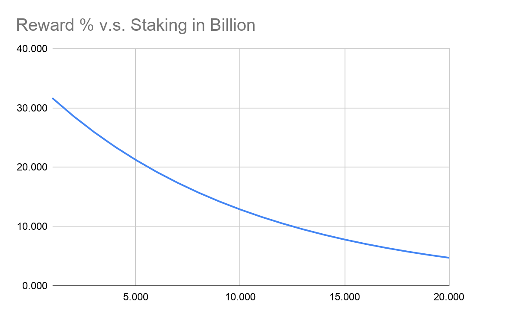
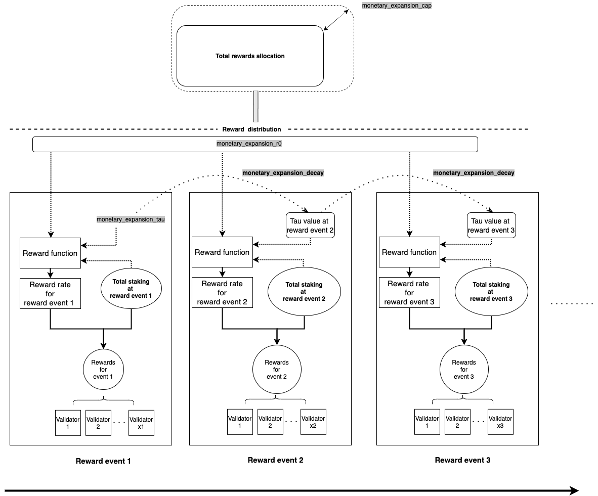
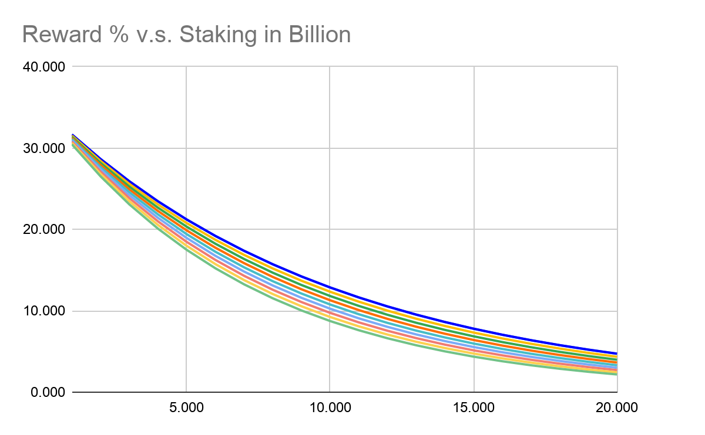

# Reward & Punishment

This document contains the specification of the rewards and punishment mechanisms which establish the foundation of the token ecosystem of CRO.

## Validator Rewards

To incentivise validators to run the network, rewards are accumulated and distributed to the validators. There are three sources for the rewards:

1. Monetary expansion with a fixed total supply
1. [Transaction Fees](./transaction.md#transaction-fee)
1. Slashing of byzantine and non-live nodes (if any)

The `RewardsPoolState` data structure stores all the information about the remaining funds and distribution states:

```js
pub struct RewardsPoolState {
    pub period_bonus: Coin, // rewards accumulated from fees and slashing during current period
    pub last_block_height: BlockHeight, // when was the pool last updated
    pub last_distribution_time: Timespec, // when was the pool last distributed
    pub minted: Coin,  // record the number of new coins ever minted, can't exceeds max supply
    pub tau: u64,  // a decaying parameter in monetary expansion process
}
```

### Overview: The reward function

**Motivation:** To incentivise the validators, the amount of the reward should dynamically react to the actual network conditions such as the _total staking_ and the _length of time_ since the genesis block.

The reward being sent to the reward pool depends on two major factors:

- **S**: The total amount of staking, and
- **R**: The reward rate per annum.

Specifically, this reward rate `R` can be expressed by the following function:

```
R = (R0 / 1000) * exp(-S / tau)
```

To visualize this, if we set `tau=10 Billion`, `R0=350`, we have the following graph of the function:



Note that the above reward rate is per annum, and the number of tokens being released to the reward pool (**N**) for that epoch is calculated by

```
N = S  *  ( (1 + R) ^ (1 / f) - 1 )
```

where `S` is the total amount of tokens staked by validators to participate in the consensus process; `R0` is the upper bound for the reward rate; `tau` is a time-dependent variable that controls the exponential rate; `f` is the frequency of reward being distributed per year.

:::tip Example: If the reward rate is 28% with total staking of 500 million and the reward is being distributed every day, the number of tokens being released to the reward pool at the end of the day will be
`500,000,000 * ( (1+0.28)^(1/365) - 1) = 338,278`
:::

More details about the actual calculation and its configuration can be found in the next section.

### Rewards: Network parameters for monetary expansion

Monetary expansion is designed to release tokens from the reserve account to the reward pool, while keeping a fixed maximum total supply.

Precisely, the reward rate is controlled by the following parameters:

- `monetary_expansion_cap`: The total amount of tokens reserved for validator's reward in the basic unit
- `reward_period_seconds`: The period of reward being distributed
- `monetary_expansion_r0`: The upper bound for the reward rate per annum
- `monetary_expansion_tau`: Initial value of tau in the reward function
- `monetary_expansion_decay`: The decay rate of tau.

You can find the configuration under the `rewards_params` section of the genesis file `genesis.json` in `./tendermint/config`,
:::details Example: Reward configuration in the genesis

```js
{
  "app_state": {
    ...
    "network_params": {
      ...
      "rewards_config": {
        "reward_period_seconds": 86400,  # range: [0, )
        "monetary_expansion_r0": 450,
        "monetary_expansion_tau": 14500000000000000,
        "monetary_expansion_decay": 999860,  # range: [0, 1000000]
        "monetary_expansion_cap": "2250000000000000000" # range: [0, 100_00000000_00000000]
      }
    }
  }
}
```

represents a daily scheduled reward (every `86400` seconds), with a maximum reward rate of _45%_ per annum, distributing a total sum of 22.5 billion tokens to the validators.
:::

::: details Reward parameters explained:
Here is a simple example of how these configuration parameters affect the reward distribution when assuming the amount of total staking is fixed:


1. Firstly, `monetary_expansion_cap` controls the total amount of tokens reserved for validator's reward (**Total rewards allocation**). Note that this number can not exceed the total supply of tokens (i.e. 100 Billion )

2. Two initial values control the amount of the reward rate at the beginning; these are:

- `monetary_expansion_r0`, a positive number represents the upper bound for the reward rate per annum;
- `monetary_expansion_tau`, the initial value of tau in the reward function.

3. Afterwards, we calculate the reward rate for that epoch by the total staking amount, value of `tau` and the constant `monetary_expansion_r0`. The final reward for validators will be the product of the reward rate and the total staking amount.

4. Lastly, the rewards will be distributed to the validators based on the number of blocks they have proposed in that reward epoch.(see [reward distribution](#reward-distribution) for details)

_Remarks_: The reward rate of shrinks in general after each reward epoch. The contraction rate is controlled by `monetary_expansion_decay`, which is the decay rate of tau in the reward function.

Note that this is an exponential decay function, where the index of it controls the “steepness” of the curve. Precisely, this damping factor controls the exponential decay rate of the reward function. The parameter `tau` will decay each time rewards get distributed:

```
tau(n) = tau(n-1) * rewards_config["monetary_expansion_decay"]
```

In addition to that, `reward_period_seconds` controls how often the reward is being distributed.

:::

At the end of each reward epoch, the number of tokens being released at each period is defined as:

```
    R0 = rewards_config["monetary_expansion_r0"]
    tau = rewards_config["monetary_expansion_tau"]
    P = rewards_config["reward_period_seconds"]

    # total bonded amount of the active validators
    at the end of the reward epoch
    S = total_staking

    # seconds of a year
    Y = 365 * 24 * 60 * 60

    R = (R0 / 1000) * exp(-S / tau)
    N = floor(S * (pow(1 + R, P / Y) - 1))
    N = N - N % 10000

    N: released coins
    S: total stakings at current block when
       reward distribution happens
    R0: upper bound for the reward rate p.a.
```

Using the example of `tau=10 Billion` and `R0=350`, the following graph shows how the reward rate deforming when `tau` is dropping by 5% every year:



The rewards validator received goes to the bonded balance of their staking account, and results in validator [voting power change](#end/commit_block_state_update) accordingly.

### Reward distribution

Rewards are distributed periodically (e.g. daily), which is determined by the [network parameter](./network-parameters.md) `reward_period_seconds`. Rewards are accumulated during each period, block proposers and the total voting power of all validators are recorded.

At the end of each reward period, validators will receive a portion of the "reward pool" as a reward for participating in the consensus process. Specifically, the reward of a validator is proportional to its contribution to the consensus process; it is calculated as follows:

```
rewards of a validator = total rewards in the pool * [Validatior's contribution] / [Sum of the voting power],
```

where

- _"Validator's contribution"_ is the total sum of the voting power participating in the consensus process by the validator throughout the reward period; and

- _"Sum of the voting power"_ represents the total sum of the voting power involved in the consensus process from all of the active validators throughout the reward period.

The remainder of division will become rewards of the next period.

### Rewards: Documentation and its interactions with ABCI

The detailed documentation of the reward mechanism can be found in [here](https://github.com/crypto-com/chain-docs/blob/master/docs/modules/reward.md).

## Validator Punishments

This part describes functionality that aims to dis-incentivize network-observable actions, such as faulty validations,
of participants with values at stake by penalizing/slashing and jailing them. The penalties may include losing some
amount of their stake (surrendered to the rewards pool), losing their ability to perform the network functionality for a
period of time, collect rewards etc.

### Punishments: Network Parameters for slashing

Below are all the network parameters used to configure the behavior of validator punishments. Details of all these
parameters and their effect on behavior of validator punishments is discussed later in this document.


1. `"block_signing_window"`: Number of blocks for which the liveness is calculated for uptime tracking.
1. `missed_block_threshold`: Maximum number of blocks with faulty/missed validations allowed for an account in last
   `block_signing_window` blocks before it gets deactivated.
1. `liveness_slash_percent`: Percentage of funds (bonded + unbonded) slashed when a validator is non-live.
1. `byzantine_slash_percent`: Percentage of funds (bonded + unbonded) slashed when validator makes a byzantine fault.

:::warning Important:
During slashing, funds are slashed from both, bonded and unbonded, amounts.
:::

### Overview

Punishments for a validator are triggered when they either make a _byzantine fault_ or become _non-live_:

- Liveness Faults (Low availability)

  A validator is said to be **non-live** when they fail to sign at least `missed_block_threshold` blocks in
  last `block_signing_window` blocks successfully. `block_signing_window` and `missed_block_threshold` are network
  parameters and can be configured during genesis (currently, changing these network parameters at runtime is not
  supported). Tendermint passes signing information to ABCI application as `last_commit_info` in `BeginBlock` request.

:::tip Example:
For example, if `block_signing_window` is `100` blocks and `missed_block_threshold` is `50` blocks, a validator will
be marked as **non-live** if they fail to successfully sign at least `50` blocks in last `100` blocks.
:::

- Byzantine Faults (Double signing)

  A validator is said to make a byzantine fault when they sign conflicting messages/blocks at the same height and
  round. Tendermint has mechanisms to publish evidence of validators that signed conflicting votes (it passes this
  information to ABCI application in `BeginBlock` request), so they can be punished by the application.

:::tip Implementation note:
Tendermint passes `Evidence` of a byzantine validator in `BeginBlock` request. Before jailing any account because of
byzantine fault, that evidence should be verified. Also, it should be checked that evidence provided by tendermint is
not older than `max_age_duration` in tendermint.
:::

### Inactivity Slashing

It is important that the validators maintain excellent availability and network connectivity to perform their tasks. A penalty should be imposed on validators' misbehavior to reinforce this.

When a validator fails to successfully sign `missed_block_threshold` blocks in last `block_signing_window` blocks, it is
immediately punished by deducting funds from their bonded and unbonded amount and removing them from active validator set. The funds to be deducted are calculated based on `liveness_slash_percent`.

:::tip Note:
The validator is not **jailed** in this scenario. They can immediately send a `NodeJoinTx` to join back as a validator if they are qualified (have enough bonded amount and not jailed).
:::

### Jailing

A validator is jailed when they make a byzantine fault, e.g., they sign messages at same height and round.

When a validator gets jailed, they cannot perform any operations relating to their account, for example,
`withdraw_stake`, `deposit_stake`, `unbond_stake`, etc., until they are un-jailed. Also, a validator cannot be un-jailed
before `account.jailed_until` which is set to `block_time + UNBONDING_PERIOD` while jailing. `UNBONDING_PERIOD` is a
network parameter which can be configured during genesis.

:::warning Important:
`block_time` used in calculating `account.jailed_until` should be the time of the block at which the fault is detected
(i.e., `current_block_height`).
:::

:::warning Important:
When a validator is jailed because of a byzantine fault, their validator public key is added to a list of permanently
banned validators and cannot re-join the network as a validator with same public key.
:::

#### Un-jailing

When a jailed validator wishes to resume normal operations (after `account.jailed_until` has passed), they can create
`UnjailTx` which marks them as un-jailed. After successful un-jailing, validators can submit a `UnbondTx` and
`WithdrawTx` to withdraw their funds.

### Byzantine Slashing

Validators are responsible for signing or proposing block at each consensus round. A penalty should be imposed on validators' misbehavior to reinforce this. When there is byzantine fault detected, they are immediately slashed other than jailed. During the jailing time, it won't be slashed again for other byzantine faults. The funds to be deducted are calculated based on `BYZANTINE_SLASH_PERCENT`.

:::warning Important:
A validator should not be slashed more than once for byzantine faults within `UNBONDING_PERIOD`. If a validator commits multiple byzantine faults
within that time period, it should only be slashed once (for simplicity, we'll only slash the validator for the first
evidence that we get from tendermint and ignore other evidences until `UNBONDING_PERIOD`).
:::

:::tip Implementation note:
To enforce that we only slash an account only once within `UNBONDING_PERIOD`, we can just check if an account is
not jailed when we receive evidence of misbehavior from tendermint.
:::

### Punishments: Documentation and its interactions with ABCI

The detailed documentation of the slashing mechanism can be found in [here](https://github.com/crypto-com/chain-docs/blob/master/docs/modules/punishment.md)

### Appendix

#### Reward related network parameters configuration

The following tables show overall effects on different configuration of the reward related network parameters:

| Key                  | `monetary_expansion_cap`           | `reward_period_seconds`           | `monetary_expansion_decay`        |
| -------------------- | ---------------------------------- | --------------------------------- | --------------------------------- |
| Higher               | More reserved validator reward     | Less frequent reward distribution | Tau decays slower                 |
| Lower                | Less reserved validator reward     | More frequent reward distribution | Tau decays faster                 |
| Constraints          | Less than the maximum token supply | Value has to be positive          | Positive value less than 1000000  |
| Sample configuration | 2e18 (20% of the total supply)     | 86400 (reward distributed daily)  | 999860 (Tau dropped by 5% yearly) |

For initial values:

| Key                  | `monetary_expansion_r0`        | `monetary_expansion_tau`  |
| -------------------- | ------------------------------ | ------------------------- |
| Higher               | Higher ceiling for reward rate | Steeper exponential curve |
| Lower                | Lower ceiling for reward rate  | Flatter exponential curve |
| Constraints          | Value has to be positive       | Value has to be positive  |
| Sample configuration | 350 (35% reward rate p.a.)     | 10 Billion                |
