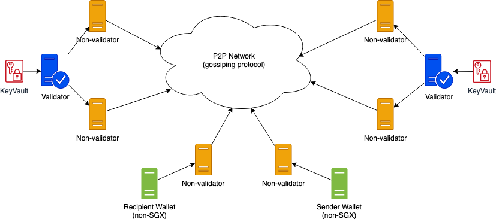

# Threat Model

Threat modeling is a systematic approach to find potential threats by decomposing and enumerating system components. There are many different methodologies and/or frameworks when conducting threat modeling, such as STRIDE, DREAD, Attack Tree, etc. In our case, our Thread Model is based on STRIDE and Attack Tree.

STRIDE provides a set of security threats in five categories (the last one is ignored):

1. Spoofing - impersonating the identity of another
2. Tampering - data is changed by an attacker
3. Repudiation - an attacker refuses to confirm an action was conducted
4. Information Disclosure - exposing sensitive information
5. Denial of Service - degrade the availability or performance of the system
6. Elevation of Privilege (not applicable in our case)

For each category, we enumerate all the potential threats by breaking down a high-level goal into more specific sub-goals, in a way similar to attack tree enumeration. And in each sub-goal, we set the risk level by combining the `Severity` and `Exploitability` of the item.

### Severity

- `5`: Severe impact on the whole system
- `4`: High impact on the whole system
- `3`: Moderate impact on the whole system or Severe impact on individual user/node
- `2`: High impact on individual user/node
- `1`: Moderate impact on individual user/node

### Exploitability

- `5`: Existing exploit code available
- `4`: Relatively easy to exploit
- `3`: Attack is practical but not easy, a successful attack may require some special conditions
- `2`: Theoretically possible, but difficult in practice
- `1`: Very difficult to exploit
- `0.1`: Almost impossible

### Assets

1. **The integrity of the account balance**: the most important piece of information in the blockchain.
2. **Validator secret keys**: one of the most powerful key, lost 1/3 of these keys will render the whole system to an unstable state.
3. **User secret keys**: key owner implies fund owner
4. **Transaction encryption keys**: transaction privacy of the system relies on the secrecy of this key

### Scope

The whole Crypto.com Chain is a complex system and involves many different components. And therefore, the scope of this threat model is limited only to the major components of the system. To be more specific, the threat modeling of Tendermint and Intel SGX is **NOT** in the scope of this threat modeling.

We also assume standard security measures like OS level hardening, software patching, anti-virus, network firewall, physical security, etc, are properly implemented, executed and monitored. These mitigation strategies are not mentioned here.

### System Diagram

### Result

[HERE](../crypto.com-chain-threat-model.pdf)
